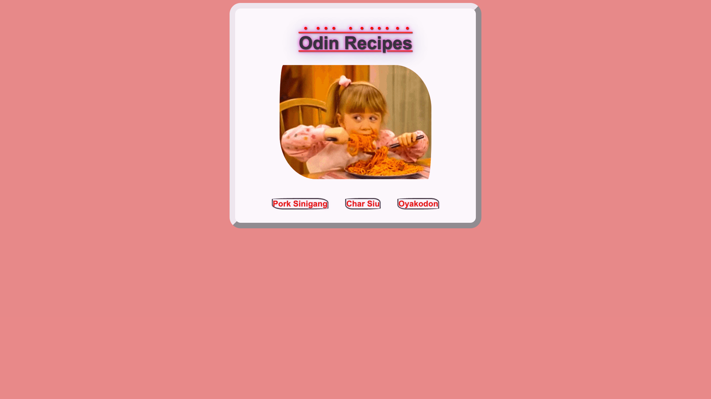
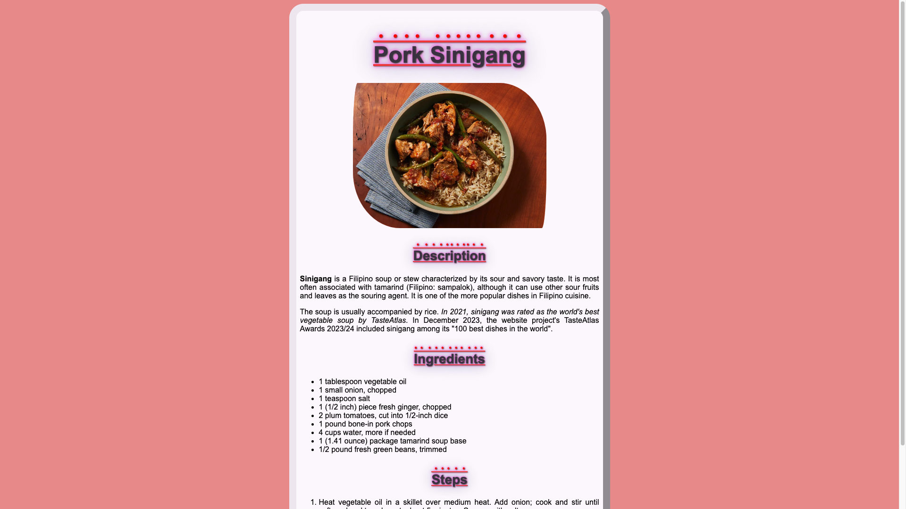
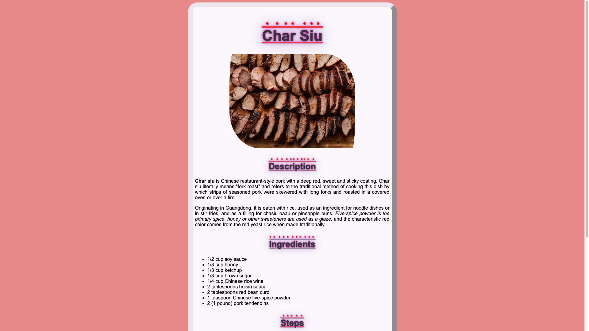
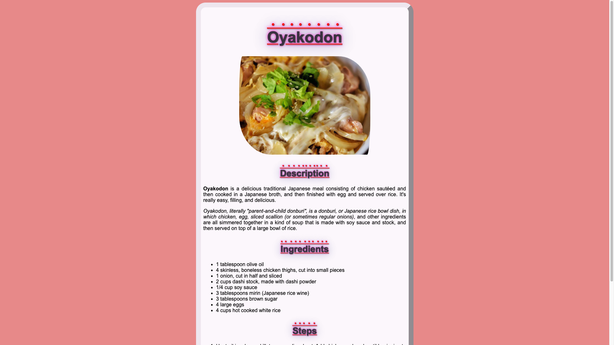

# odin-recipes
A Basic Recipe Website ([Live Preview](https://orghmaitr.github.io/odin-recipes/))

## Status
***This project is no longer being actively worked upon.***

## Description
**odin-recipes** is the [first project](https://www.theodinproject.com/lessons/foundations-recipes) from the [Foundations Course](https://www.theodinproject.com/paths/foundations/courses/foundations) in the [The Odin Project](https://www.theodinproject.com/about).

This is a basic recipe website which consists of a main index page with links to three recipes.

## Screenshots

## Technologies
- **Git**
- **HTML**
- **CSS**
- **GitHub Pages**

## Improvements
- [x] Style it up with CSS
- [x] Apply CSS box model to index page
- [x] Style up index page with layouts, colors, and styles

## Extra Additions
- [x] Style up rest of the web pages with layouts, colors, and styles

## Self Reflections
- This is the first time I've dealt with web development. It was quite a fun experience.
- I incorporated the HTML boilerplate which included the following elements: declaring the doctype, specifying meta-information using head, setting UTF-8 encoding using charset, giving a title, and displaying content using body. I utilized several other elements, such as, headings, paragraphs, bold, italicized, lists, links, and images.
- I learned the following: how to ask technical questions, computer basics, how the web works, command line basics, Git and GitHub fundamentals, how to write great atomic commit messages, and viewing project on the web via GitHub Pages.
- I stylized all the webpages with the following CSS selector types: universal selector, type selectors, class selectors, ID selectors, grouping selectors, chaining selectors, and descendant combinators. I also used the following CSS properties: background-color, color, font-family, font-size, font-weight, text-align, image height and width. I made sure to follow the cascade rules, namely, specificity, inheritance, and rule order.
- I utilized the newly learned standard and alternative CSS box model to change the look and feel of the entire recipe website.

## Acknowledgements
- This README is inspired by [ritaly's README cheatsheet](https://github.com/ritaly/README-cheatsheet).
- The contents for the index page and the recipe webpages were directly taken from [allrecipes](https://www.allrecipes.com/), [Wikipedia](https://www.wikipedia.org/), and [tenor](https://tenor.com/en-GB/view/food-eat-spaghetti-hungry-snacks-gif-14482626).

## Contact and Support
- Please feel free to contact orghmaitr_92650 on discord for project related queries.
>*This project will no longer be worked upon because of two reasons that are clearly stated in the [TOP strategy guide](https://dev.to/theodinproject/becoming-a-top-success-story-mindset-3dp2). These are [only to focus on the point of the assignment](https://dev.to/theodinproject/learning-code-f56) and [foundations isn't a strong portfolio generator](https://dev.to/theodinproject/strategically-building-your-portfolio-1km4)*.
